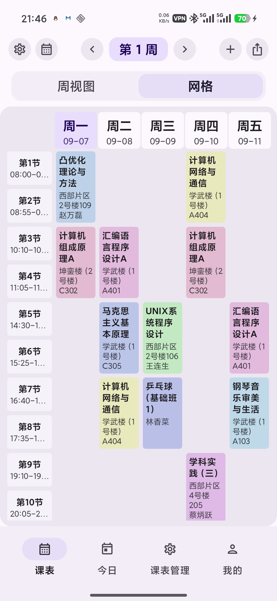
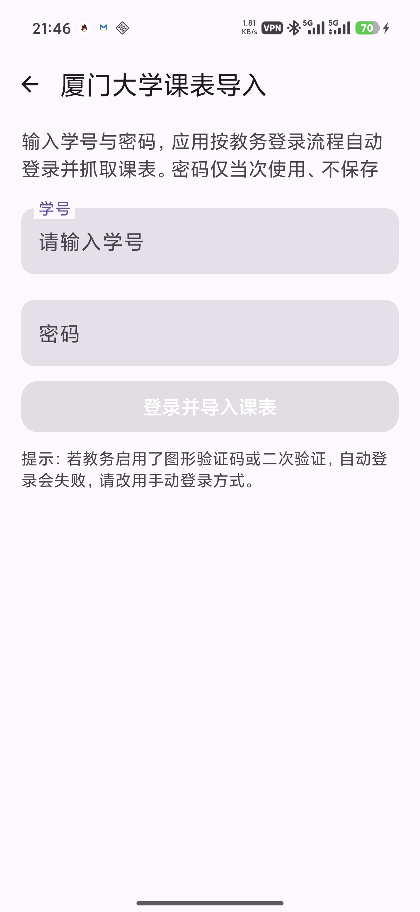
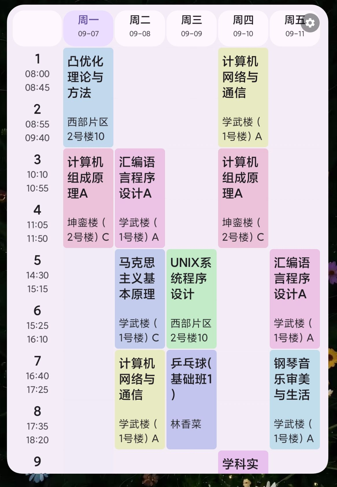
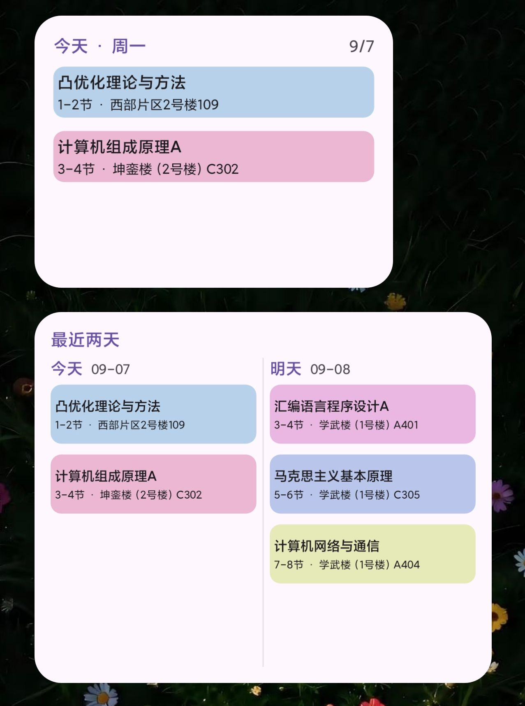

<p align="center">
  
</p>

<h1 align="center">厦大课表</h1>

<p align="center">
  厦门大学课程表 Android 应用 — 更适合厦大宝宝的课程表
</p>

<p align="center">
  
  
  
  
  
</p>

<p align="center">
  Android 8.0+ · 包名 <code>com.arroghie.xmutimetable</code>
</p>

---

## 简介

厦大课表是为厦门大学学生定制的课程表应用：账号密码登录厦门大学统一身份认证后，自动从教务系统（jw.xmu.edu.cn）抓取本学期课表并落库，支持手动添加、多课表管理与课程提醒。

## 预览

**主页面**



**课表导入**
输入账号密码自动导入



**小组件**

 

## 功能特性

- **教务直连导入**：账号密码自动登录厦门大学统一身份认证，自动抓取课表并创建（无需手动配置开学日期与节次时间）
- **多视图课表**：周视图（7 日 × N 节）、网格视图（时间网格课程色块）、今日视图，顶部一键切换
- **多课表管理**：同时管理多张课表，每张表拥有独立的节次时间、开学日期与最大周数
- **桌面小组件**：今日课程 / 本周课程（可上下滚动）/ 最近两天，均可自由调整大小，颜色随应用主题
- **课程提醒**：每日课表推送与每节课前提醒
- **个性化**：Material You 动态取色、多套主题配色、HSV 自定义颜色、桌面小组件样式微调

## 技术栈

- Kotlin · Jetpack Compose · Material 3
- Room · DataStore · WorkManager · Coil
- 小组件基于 RemoteViews + Canvas 位图渲染（ListView 滚动条带）

## 构建

环境要求：JDK 25、Android SDK 36、Gradle 9.x。

```bash
# 调试包
./gradlew :app:assembleDebug

# 单元测试
./gradlew :app:testDebugUnitTest

# 发行包（按 ABI 拆分输出到 app/build/outputs/apk/release/）
./gradlew :app:assembleRelease
```

## 关于本项目

本项目基于 <https://github.com/lingion/sleepy> 开发，是针对厦门大学教务系统定制的专属版本（fork 改造），遵循其 GPL-3.0 开源许可。作者：**ArrogHie**。

## 许可

本项目以 [GPL-3.0](LICENSE) 许可发布。
